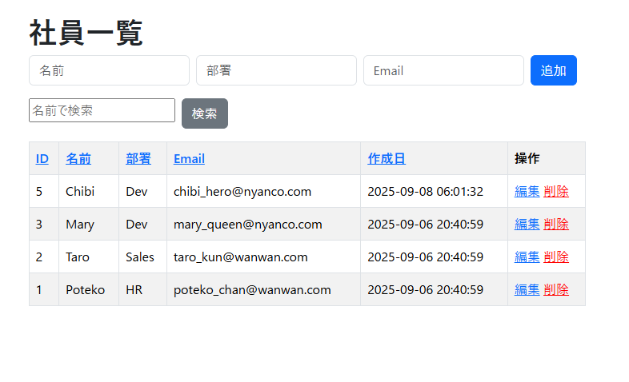

# PHP CRUD 社員管理アプリ

シンプルな社員管理システム（Create / Read / Update / Delete）。  
生 PHP + MySQL + Bootstrap を用いた学習用ポートフォリオ。

---

## 機能

- 社員一覧表示（検索・ソート対応）
- 社員追加（名前・部署・Email）
- 社員編集（更新フォーム）
- 社員削除（確認ダイアログ）
- バリデーション（必須・文字数・Email 形式）
- CSRF トークンによるセキュリティ対策
- XSS 対策（`htmlspecialchars` を共通関数化）
- UI 整備（Bootstrap CDN）

---

## セットアップ

### 必要環境

- PHP 8.x
- MySQL 8.x
- Composer（任意）

### 手順

```bash
# リポジトリ取得
git clone https://github.com/<yourname>/employee-php-crud.git
cd employee-php-crud

```

# DB 作成

mysql -u root -p
CREATE DATABASE testdb CHARACTER SET utf8mb4 COLLATE utf8mb4_general_ci;

# ユーザ作成（例: dev）

CREATE USER 'dev'@'localhost' IDENTIFIED BY 'password';
GRANT ALL PRIVILEGES ON testdb.\* TO 'dev'@'localhost';
FLUSH PRIVILEGES;

# テーブル作成

USE testdb;
CREATE TABLE users (
id INT AUTO_INCREMENT PRIMARY KEY,
name VARCHAR(50) NOT NULL,
dept VARCHAR(50),
email VARCHAR(100) NOT NULL UNIQUE,
created_at TIMESTAMP DEFAULT CURRENT_TIMESTAMP
);

# 開発サーバー起動

php -S 127.0.0.1:8000 -t public
ブラウザで http://127.0.0.1:8000 にアクセス。

## 画面イメージ

### 一覧



### 編集


### 削除


## 工夫点

- フォーム再表示時に入力値を保持
- 名前/Email の厳格バリデーション
- CSRF トークンによる POST 保護
- 共通関数 e() による XSS 対策
- Bootstrap で最小限の UI 整備

## ライセンス

このリポジトリは [MIT License](LICENSE) のもとで公開されています。
